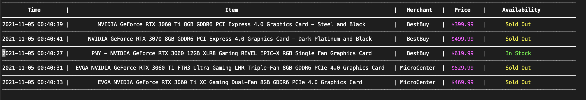
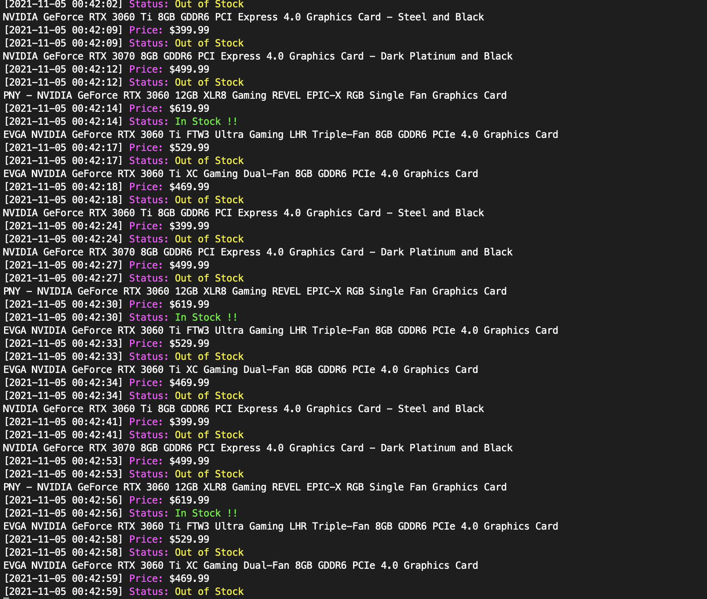

# Stock Monitoring

## Description

It is a stock monitoring script. This repository is still under developing.

### Monitoring Websites (for now)

- BestBuy
- Adorama (Can not bypass the CAPTCHA now. Working on that)
- MicroCenter (Location: MA; changeable)

## Getting Started

### Prerequisites & Installing
Current running OS: MacOS

This script is being tested on macOS. For Windows and Ubuntu user, replacing selenium is necessary.
```
pip install selenium
git clone https://github.com/Sission/StockMonitoring.git
```
Add the url of your desired item in to *url.txt*

Add telegram bot configuration to get real time notification. Check [this](https://core.telegram.org/bots) to see how
to add a telegram bot.

Open file */restock/telegram_info.txt* to paste and replace your _api_key_ and
_user_id_. 


### Executing Program

```
python run main.py --print_format <format>
```


### Example
#### Table mode

```
python run main.py --print_format "Tabel"
```


#### Flow mode

```
python run main.py --print_format "Flow"
```



### Future Functions
 - Docker package in Windows
 - Monitor other websites such as Newegg.com
 - Detect MicroCenter choose location window
 - Automatically check out