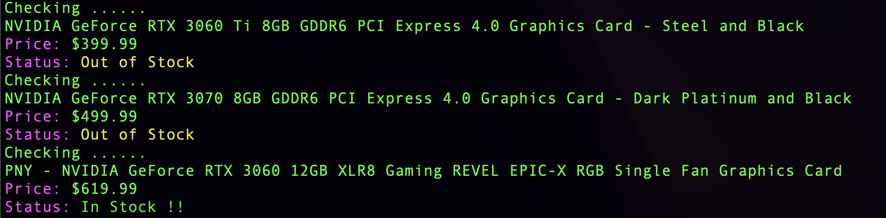

# Stock Monitoring

## Description

It is a stock monitoring script. This repository is still under developing.

## Getting Started

### Prerequisites & Installing

```
pip install selenium
git clone https://github.com/Sission/StockMonitoring.git
```
Add the url of your desired item in to *bestbuy_url.txt*

### Executing program
```
python run bestbuy_main.py
```
### Example



### Future Functions
 - Monitor other websites such as Newegg.com, Micro Center
 - Send notification via text or Webhook
 - Pay for the item automatically 
 - Docker package
 